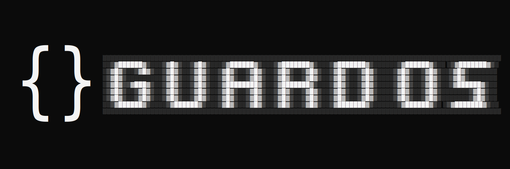

# GuardOS

O Programa que você precisa para seu estacionamento, de forma inteligente, moderna e eficaz.

## Dependências

- Para executar o GuardOS corretamente, será necessário a instalação da dependência "Runtimme .NET 8.0", disponível em [Instalador Runtime .NET 8.0](https://download.visualstudio.microsoft.com/download/pr/24682756-e652-486d-a9f7-c4411f3141e9/39e6bb61fab38fdfb3472305174422cb/aspnetcore-runtime-8.0.5-win-x86.exe).

- Se necessário a alteração ou adaptação do código fonte, será necessário também a instalação da Dependência "SDK .NET 8.0", disponível em [Instalador SDK .NET 8.0](https://download.visualstudio.microsoft.com/download/pr/9736c2dc-c21d-4df6-8cb7-9365ed5461a9/4c360dc61c7cb6d26b48d2718341c68e/dotnet-sdk-8.0.300-win-x86.exe).
    
## Screenshots
_Menu Principal_
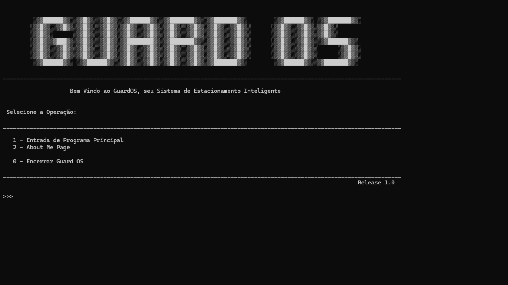

_Menu Atendimento_
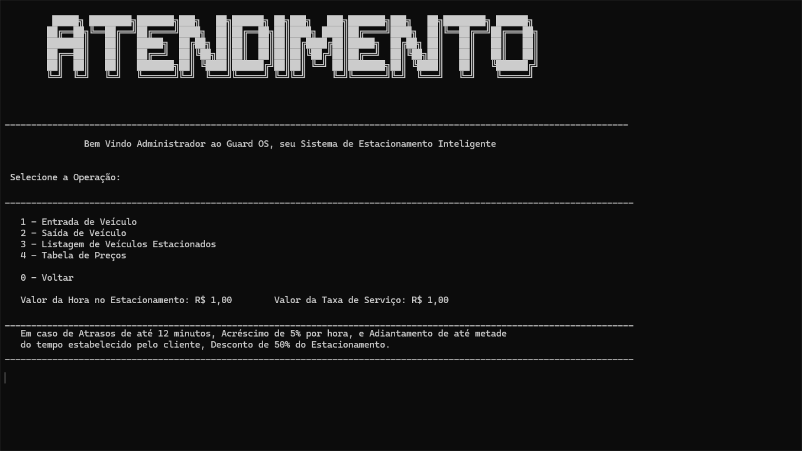

_Entrada de Veículos_
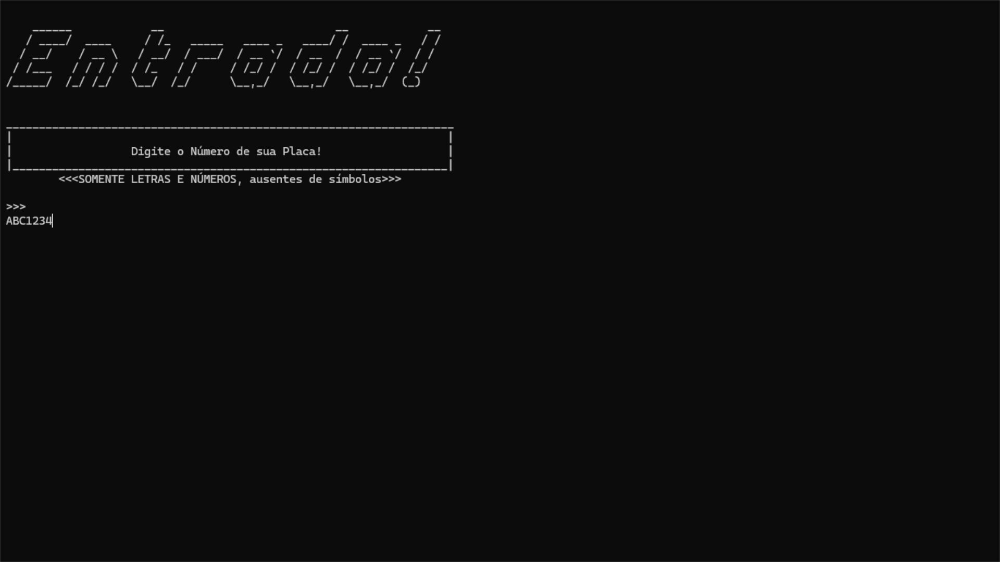

_Saida de Veículos_
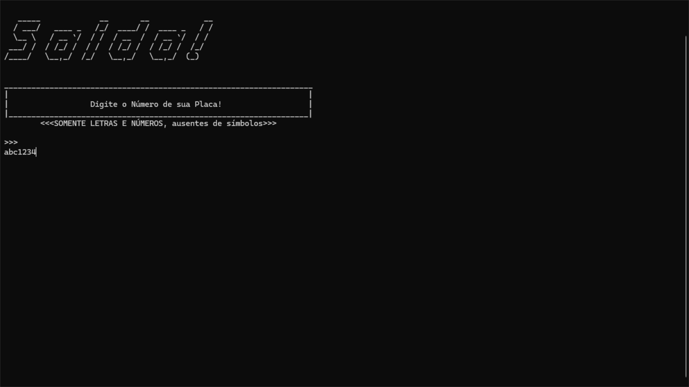

_Lista de Veículos Estacionados_

## Melhorias

_Tabela de Preços_
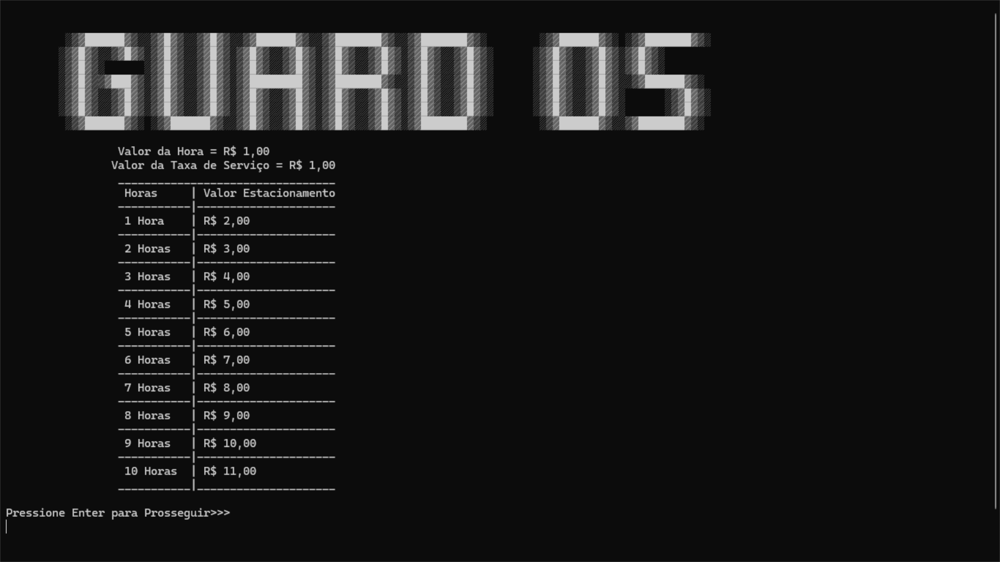

_Sistema de Pagamento via Operador Manual_
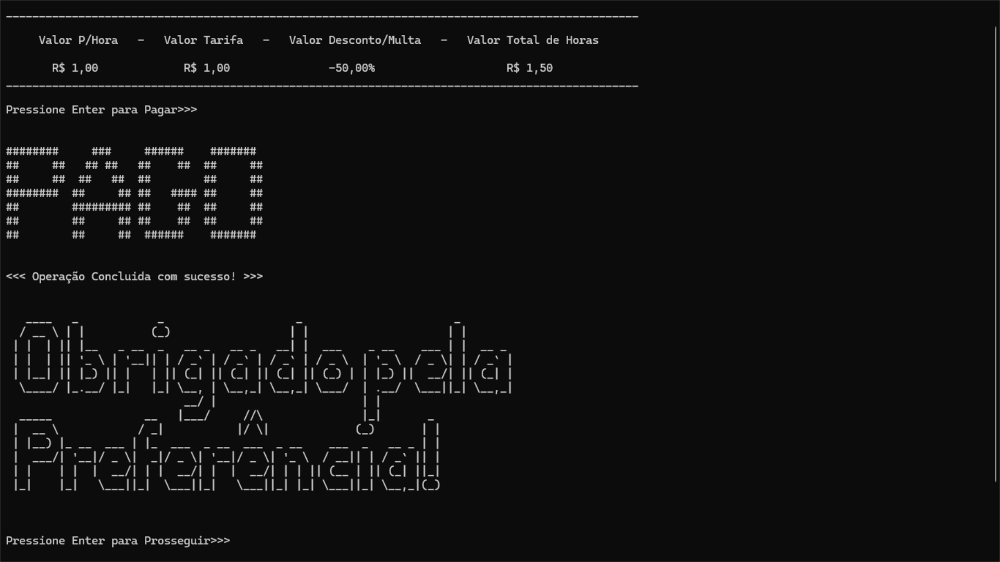

_AboutMe Page_
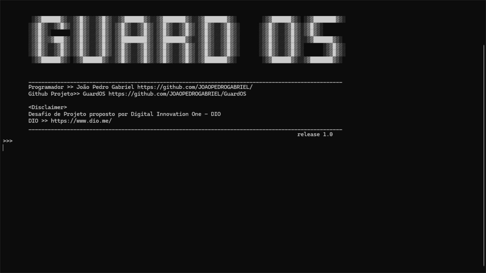

_Login Page Aprimorado_
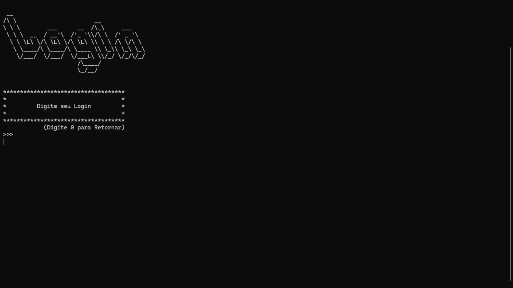

_Segurança ao Realizar Logoff_
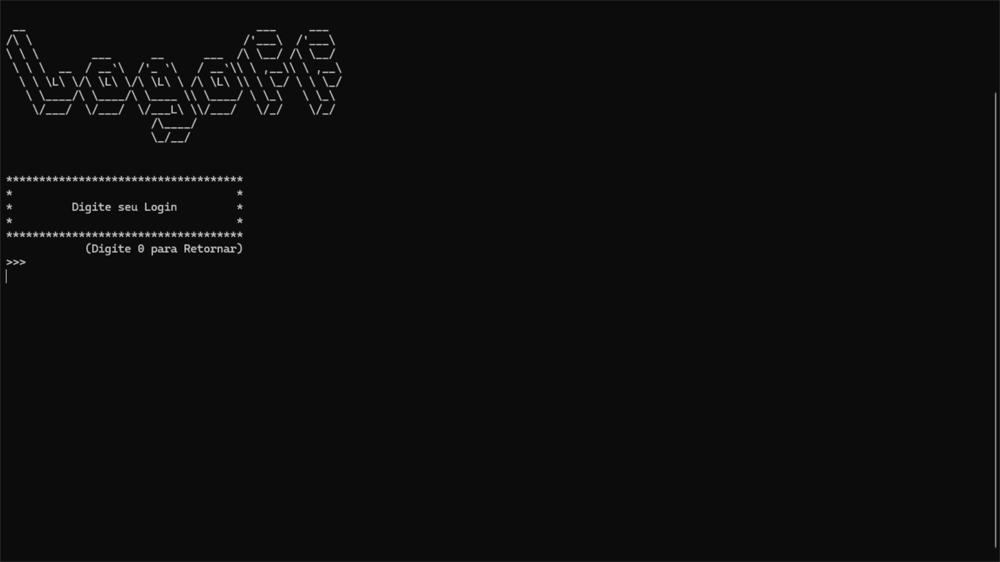

### Tabela de Acesso de Login no aplicativo:
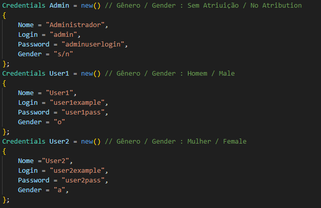

## Suporte
Para suporte, mande um  [Email](jpgab.dev@gmail.com), e descreva sua experiência com o Guard OS.

### ___<<!!! Atenção !!!>>___
O Guard OS necessita de um Operador Manual durante seu funcionamento, pelo menos por enquanto, uma vez que NÃO possui um Operador Autonomo para Autoatendimento do Cliente!

# Olá, eu sou o João Pedro Gabriel 👋

## 🚀 Sobre mim
Desenvolvedor full-stack, aos 18 anos, eu programo com os recursos .NET, e outras linguagens a parte, como forma de adquirir experiencia proficional, durante minha formação acadêmica, com auxílio de ferramentas como a DIO "Digital Innovation One", e Unicesumar, na qual ainda estou no meu primeiro ano de faculdade, também sou aprendiz autodidata de Inglês no Duolingo.

## 🛠 Habilidades
### ___Criação de Sites___

### ___Criação de Aplicações___

### ___Manuseio de Ferramentas___

## 🔗 Contato

## Licença
[Creative Commons CC BY SA 4.0](http://creativecommons.org/licenses/by-sa/4.0/)

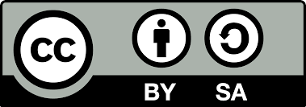
